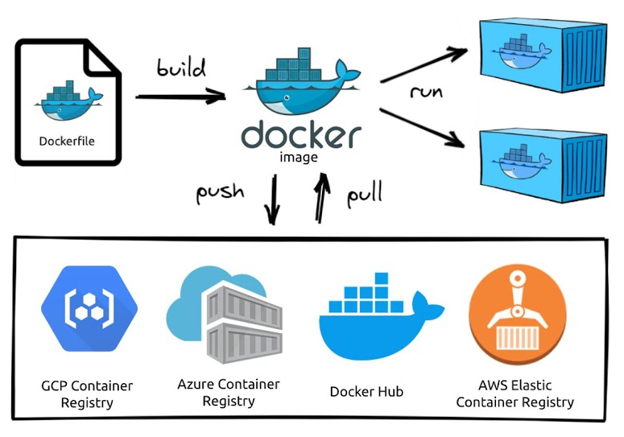
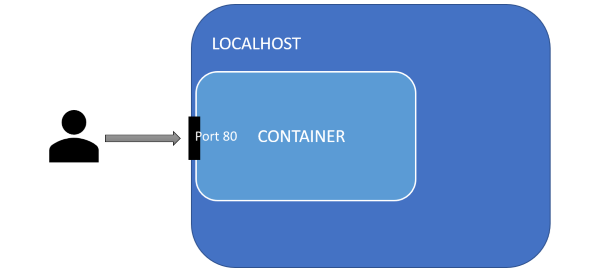
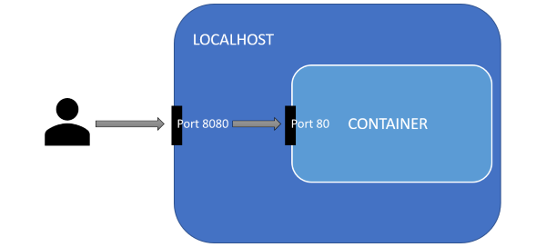

# Практическое задание 3. Docker

**Цель:** ознакомится с базовыми возможностями Docker. Приобрести опыт и навыки контейнеризации приложений.

## Задания к практической работе

Каждую выполненную вами команду и результат её работы поместите в отчёт в виде скриншота. Если несколько команд и их выводы видны на одном скриншоте, в отчет можно вставить 1 скриншот на несколько команд. Команды остановки и удаления контейнеров тоже можно не помещать в отчёт.

Для данной работы можно использовать Ubuntu Server или Ubuntu Desktop по вашему выбору.

### Настройка DNS

В некоторых случаях при попытке обновить индексы пакетов или установить пакет вы можете получить ошибку связанную с тем, что не удалось определить (resolve) ip-адрес сервера по доменному имени. Как правило эта ошибка связана с неправильной настройкой dns.

1. Для начала нужно определить название сетевого интерфейса через который машина выходит в интернет. В нашем случае этому интерфейсу выдаётся ip-адрес роутером (т.к. сеть VirtualBox в режиме сетевого моста). Введите команду `ip a` и найдите название интерфейса:  
   

   В моём случае сетевой интерфейс называется "enp0s3".

2. Чтобы установить для данного интерфейса dns можно воспользоваться 2-мя вариантами (выберите любой):

   - Временный вариант, он будет отменятся после перезагрузки сервера. Нужно ввести команду:  
     ```bash
     sudo resolvectl dns enp0s3 8.8.8.8
     ```

     Здесь мы добавляем в список dns-серверов dns-сервер google. Чтобы проверить, что команда выполнилась успешно введите:  
     ```bash
     sudo resolvectl dns enp0s3
     ```

     В результате вы должны увидеть список dns-серверов для интерфейса "enp0s3".

   - Постоянный вариант. Для этого нужно воспользоваться утилитой `netplan` - это основной способ настройки сети в современных дистрибутивах Ubuntu. Все конфигурационные файлы `netplan` хранят в директории "/etc/netplan".

     - Посмотрите содержимое каталога "/etc/netplan". В моём случае там только один файл "00-installer-config.yaml" в котором указаны такие настройки:  
       ```yaml
       network:
         ethernets:
           enp0s3:
             dhcp4: true
         version: 2
       ```

     - Посмотрите актуальные настройки при помощи команды: `sudo netplan get`. Вывод должен быть такой же.

     - создайте в каталоге "/etc/netplan" файл с названием "01-dns.yaml", имя конфиг-файла может быть любым, но обязательно с расширением ".yaml". Номер в начале определяет порядок применения конфиг-файлов.

     - В этом файле пропишите:  
       ```yaml
       network:
         ethernets:
           enp0s3:
             nameservers:
               addresses: [8.8.8.8]
       ```

       В этом файле мы указываем только те настройки которые хотим *добавить*. В данном случае я хочу для интерфейса `enp0s3` добавить сервера разрешения имён (т.е. dns) "nameservers" и адреса этих серверов "addresses" указываю в виде списка через запятую (в моём случае 8.8.8.8 достаточно).

     - Запустите команды:  
       ```bash
       sudo netplan generate
       sudo netplan applay
       sudo netplan get
       ```

       Первая команда пройдётся по всем yaml файлам в "/etc/netplan" и склеит их в порядке номеров файлов. Вторая команде применит новые настройки к сети. Третья команда покажет текущий *полный* конфиг.  
       Таким же образом можно настроить и всё остальное для каждого сетевого интерфейса, например: статический ip, шлюз по умолчанию, маршруты, подключение к wi-fi сети и т.д.

### Установка компонентов Docker Engine

Docker Engine - это технология предназначенная для создания и контейнеризации ваших приложений. Docker Engine действует как клиент-серверное приложение и состоит из:

- Серверная часть представленная в виде демона `dockerd`. Этот процесс непосредственно занимается работой с образами, контейнерами, томами и т.д. Управляет их созданием, следит за работой, собирает информацию, а также предоставляет пользовательский интерфейс для всего этого (центральный прямоугольник на изображении).
- Интерфейса командной строки (CLI) который позволяет взаимодействия с демоном Docker при помощи команд из терминала (левый прямоугольник на изображении).
- API который можно использовать для взаимодействия с демоном Docker в своих программах (на изображении нет, т.к. api это не отдельная программа а набор http запросов на которые реагирует docker демон).


Установим docker и docker compose согласно инструкции с [оф сайта](https://docs.docker.com/engine/install/ubuntu/).

3. Для удобства дальнейшей работы, подключитесь к машине по ssh например при помощи KiTTY.

4. Обновите индексы пакетов: `sudo apt-get update`.

5. Устанавливать docker и docker compose будем из официальных репозиториев Docker.  
   **Примечание 1:** далее в тексте команд, в конце строки может встречаться символ `\`. Этот символ - не часть команды, а спец. способ, который служит для переноса части команды на новую строку (для красоты и удобства чтения). После этого символа должен быть нажат Enter и далее продолжение команды.  
   **Примечание 2:** если вы скопируете и вставите команду в которой (в середине) присутствует `\`, то в некоторых терминалах (например KiTTY) можно получить некорректное выполнение команды. Если у вас такой случай, то копируйте команды построчно до символа `\` (и его тоже), после него нажимаете Enter и копируете дальше.

   - Установим некоторые нужные пакеты:  
     ```bash
     sudo apt-get install ca-certificates curl gnupg
     ```
     
   - Добавим официальный GPG-ключ для доступа к репозиторию Docker:  
     ```bash
     sudo install -m 0755 -d /etc/apt/keyrings
     curl -fsSL https://download.docker.com/linux/ubuntu/gpg | sudo gpg --dearmor -o /etc/apt/keyrings/docker.gpg
     sudo chmod a+r /etc/apt/keyrings/docker.gpg
     ```
     
   - Следующая команда настроит репозиторий:  
     ```bash
     echo \
       "deb [arch="$(dpkg --print-architecture)" signed-by=/etc/apt/keyrings/docker.gpg] https://download.docker.com/linux/ubuntu \
       "$(. /etc/os-release && echo "$VERSION_CODENAME")" stable" | \
       sudo tee /etc/apt/sources.list.d/docker.list > /dev/null
     ```
     
   - После добавления нового репозитория обновим индексы пакетов:  
     ```bash
     sudo apt-get update
     ```

   - Теперь установим docker и docker compose:  
     ```bash
     sudo apt-get install docker-ce docker-ce-cli containerd.io docker-buildx-plugin docker-compose-plugin
     ```

   - Добавьте текущего пользователя в группу docker:
     
     ```bash
     sudo usermod -aG docker $USER
     ```
     
     Здесь `USER` это переменная среды в которой хранится логин текущего пользователя, а значок `$` перед именем переменной среды приводит к тому, что её значение подставляется в команду в виде текста. Например `echo $USER ` напечатает имя текущего пользователя.  
     Добавление пользователя в группу "docker" позволит ему запускать команды docker-а без необходимости постоянно вводить `sudo` иначе придётся это делать постоянно.
     
   - Перелогиньтесь или перезагрузите сервер чтобы изменения вступили в силу;
     
   - Проверьте, что установка прошла успешно:  
     
     ```bash
     docker version
     docker compose version
     ```
     
     В данном случае мы установили плагин "compose" для docker, но есть и отдельный пакет "docker-compose" (как видно разница в наличии `-`). На данный момент он считается устаревшим.

### Начинаем работать с Docker

Для того, чтобы начать работать с docker нам нужен хотя бы один образ (image). Образ можно получить двумя способами: собрать вручную из Dockerfile или скачать (pull) готовый из репозитория образов (самый популярный [DockerHub](https://hub.docker.com/)).  
Имея образ мы можем запускать виртуальные машины (container) при помощи команды `run`.



6. Выполните команду:  
   ```
   docker --help
   ```

   Изучите список команд и опций доступных для управления docker. Для каждой команды из списка тоже можно вызвать справку, чтобы уточнить уже её список подкоманд и опций и т.д.  
   Большинство команд docker имеют альтернативный вариант написания (alias) который можно найти в справке, например `docker images ls --help` покажет, что у этой команды есть ещё 2 псевдонима `docker image list` и `docker images`. Используйте тот вариант который вам больше нравится. 

7. Выполните команду:  

   ```bash
   docker image ls
   ```

   Данная команда позволяет посмотреть список образовав которые есть у вас на локальной машине. Сейчас список должен быть пустой.

8. Выполните команду:  

   ```bash
   docker run hello-world
   ```

   Данная команда позволяет создать новый контейнер (виртуальную машину) из образа с именем "hello-world".  Чтобы это сделать образ должен быть у вас на локальной машине.  
   Т.к. у нас сейчас нет этого образа, то docker отправится искать его в репозиторий образов, т.е. на DockerHub, затем скачает его оттуда и после этого вернётся к выполнению команды `run`.

9. Ещё раз проверьте список локальных образов. Теперь там должен быть один образ - тот самый "hello-world".

10. Команда `run` запустила контейнер, который отработал, вывел на экран приветственное сообщение и тут же завершит свою работу (т.е. виртуальная машина выключилась). Чтобы проверить список контейнеров, которые когда либо были запущены воспользуйтесь командой:  

    ```bash
    docker container ls -a
    ```

    Изучите  информацию о контейнерах. Сейчас у вас в списке должен быть только один контейнер и в столбце `STATUS` должно значится `Exited (0)`, т.е. контейнер остановился и его главный процесс вернул код ошибки 0.  
    Более короткий вариант команды: `docker ps -a`.

11. Запустите ещё несколько контейнеров из образа "hello-world" и изучите как изменился список контейнеров.  
    Теперь docker больше не будет скачивать образ, т.к. он уже есть на машине.  

12. Посмотрите список контейнеров, но в этот раз добавьте к команде опцию `-s`. В результате у вас появится дополнительный столбец `SIZE` показывающий размер занимаемый контейнером на диске.  
    Как видно, собственный размер контейнеров 0 Байт, а значение указанное в скобочках - это размер образа на котором основаны контейнеры (образ один для всех наших контейнеров). Реально контейнер хранит только ту информацию, которая отличается в нём от базового образа.

13. В результате работы у вас может накопится довольно большое количество контейнеров. И хотя каждый из них занимает мало места на диске полезно уметь их удалять.  

    Введите команду и удалите один контейнер:  
    ```bash
    docker rm {CONTAINER ID | CONTAINER NAME}
    ```

    Здесь вместо `{CONTAINER ID | CONTAINER NAME}` нужно указать либо идентификатор контейнера, либо его имя. Эта информация у вас на экране. В случае, если вы решите воспользоваться `CONTAINER ID`, то достаточно ввести первые несколько символов (ровно столько, чтобы докер мог отличить нужный id от других, иногда достаточно одного символа); в случае с `CONTAINER NAME` имя нужно вводить полностью, но здесь вам поможет <kbd>Tab</kbd>.

14. Когда образов накапливается очень много, то перечислять все их имена или id в команде `rm` не очень удобно, поэтому, все *остановленные* контейнеры можно удалить командой:  
    ```bash
    docker container prune
    ```

    Удалите все оставшиеся контейнеры.

15. Образ "hello-world" нам больше не понадобится, поэтому удалите его командой:  

    ```
    docker rmi hello-world
    ```

    Команда удаления образа не сработает, если существуют контейнеры, которые созданы на его основе. В этом случае нужно сначала удалить их или воспользоваться опцией `-f` для принудительного удаления образа.

### Способы запуска контейнера

16. Выполните команду:  
    ```bash
    docker pull nginx
    ```

    Эта команда скачает образ [nginx](https://hub.docker.com/_/nginx) с DockerHub без запуска контейнера.

17. Запустите новый контейнер из образа "nginx" при помощи команды `run` без параметров.  
    Эта команда запустит контейнер в режиме по умолчанию, который называется attached mode. Это означает, что стандартный ввод (stdin), стандартный вывод (stdout) и стандартный вывод ошибок (stderr) контейнера подключены к сеансу текущей оболочки. Т.е. любой вывод из контейнера немедленно выводится на наш терминал, а любой ввод с терминала отправляется в контейнер. Однако мы не можем полноценно взаимодействовать с контейнером, потому что у него нет своего терминала.

18. Т.к. весь наш ввод отправляется к контейнер, то мы не можем работать с хостовой системой. Остановите контейнер при помощи комбинации клавиш  <kbd>Ctrl</kbd> +  <kbd>C</kbd>. Эта комбинация завершит основной процесс контейнера и он автоматически остановится.

19. Выполните у себя в терминале команду `tty`.  
    В результате вы должны увидеть, путь к виртуальному устройству с которым ассоциирован терминал.

20. Контейнер можно попросить запустить внутри себя команду указав саму команду и её аргументы после имени образа. Попросим его выполнить команду `tty`:  
    ```bash
    docker run nginx tty
    ```

    Как следует из сообщения, собственного терминала в контейнере нет.  
    Попросив контейнер выполнить команду мы заменили его *основную команду* своей, поэтому контейнер сразу завершит работу после её выполнения. Т.е. в данном случае сервер внутри контейнера запущен не будет. 
    
21. Чтобы решить проблему захвата ввода-вывода нашего терминала контейнером запустите новый контейнер из образа "nginx" при помощи команды:  

    ```bash
    docker run -d nginx
    ```

    Опция `-d` запустит контейнер в detach mode, т.е. контейнер будет отсоединён от нашего терминала и будет работать в фоне (background), кроме того на экран будет выведен id контейнера. Это позволит вам взаимодействовать с системой и дальше, и кроме того когда вы отключитесь от сервера контейнер продолжит работать.

22. Выполните команду:  

    ```bash
    docker ps
    ```

    Без опции `-a` эта команда показывает только работающие в данный момент контейнеры. Сейчас у вас должен быть только один такой контейнер.

23. Работающий контейнер можно остановить командой `docker stop` и заново запустить командой `docker start`. Так же как и при удалении нужно указать `CONTAINER ID` или `CONTAINER NAME` целевого контейнера.  
    Остановите контейнер используя его id.  
    Обратите внимание, команда `run` не используется для запуска остановленных контейнеров, она создаёт новый.

24. Последний, используемый на практике, способ запуска контейнера - интерактивный режим. В этом режиме внутри контейнера создаётся сеанс оболочки (shell session), который позволяет взаимодействовать с ним напрямую через терминал. Т.е. мы как-бы попадаем внутрь контейнера и работаем там.   
    Выполните команду:  

    ```bash
    docker run -it nginx
    ```

    Здесь используются две опции `-t` - создает псевдо-терминал (pseudo TTY) внутри контейнера; `-i` - перенаправляет наш ввод на стандартный ввод псевдо-терминала контейнера.

25. Для данного контейнера вы получите такую же самую "картину" как и для запуска без параметров, но для других контейнеров отличия будут (увидим далее).  Остановите контейнер.

26. Убедимся, что при запуске контейнера в интерактивном режиме в нём есть терминал.  
    Выполните команду:  

    ```bash
    docker run -it nginx tty
    ```

27. Удалите все созданные контейнеры.

28. В процессе работы у нас постоянно накапливаются ненужные контейнеры и их приходится постоянно удалять. Чтобы попросить контейнер автоматически удалиться после остановки, можно добавить к команде запуска опцию `--rm`.  
    Запустите контейнер:  

    ```bash
    docker run --rm -d nginx
    ```

29. Теперь остановите его при помощи команды `docker stop` и id контейнера, а затем проверьте список всех контейнеров. Он должен быть пуст.


### Взаимодействие с контейнером

По умолчанию все docker контейнеры запускаются изолированными друг от друга и от хостовой системы. Поэтому далее рассмотрим как получить возможность "общаться" с контейнером.

#### Выполнение команд внутри запущенного контейнера

Одним из востребованных способов взаимодействия с контейнером - это прямое выполнение команд.

30. Запустите новый контейнер nginx:  
    ```bash
    docker run --rm -d nginx
    ```

31. Выполните команду:  
    ```bash
    docker exec -it {CONTAINER ID | CONTAINER NAME} bash
    ```

    Здесь ключи `-it` используются в том же значении, что и ранее (интерактивный режим). В конце указывается команда которую нужно запустить в контейнере вместе с параметрами. В данном случае мы хотим запустить сеанс командной оболочки bash, т.е. своего рода терминал.  
    В результат у вас должно измениться приглашение к вводу и все ваши последующие команды будут выполнятся внутри контейнера.

32. Перейдите в каталог "/usr/share/nginx/html" и посмотрите его содержимое.  
    Там должно быть 2 файла, среди которых "index.html".

33. Попробуйте открыть его при помощи текстового редактора `nano`.  
    Вы обнаружите, что этот редактор не установлен в контейнере.

34. Обновите индексы пакетов `apt` и установите `nano` (название пакета такое же).

35. Проверьте, что теперь файл успешно открывается.

36. Отключитесь от контейнера при помощи `exit`.  
    Контейнер продолжит работать дальше и при необходимости мы в любое время снова сможем к нему подключиться.  
    Команда `exec` не требует обязательного входа в контейнер для запуска команд, например:  

    ```bash
    docker exec {CONTAINER ID | CONTAINER NAME} ls -al
    ```

    выполнит команду `ls -al` в контейнере и сразу отобразит её результат на экран.

#### Сетевое взаимодействие

Перед выполнением рекомендуется ознакомится с [этим](https://itisgood.ru/2019/10/29/objasnenie-koncepcii-setej-v-docker/) постом.

##### Как общаться с одним контейнером

37. Ранее мы запускали контейнер с nginx, который, кроме прочего, используется и как web-сервер для простых сайтов. Запустите новый контейнер в detach mode и попробуйте получить от него ответ на GET-запрос (nginx прослушивает 80 порт):  
    ```
    curl 127.0.0.1:80
    ```

    В результате вы должны получить ошибку, т.к. nginx хоть и слушает 80 порт но внутри своей изолированной от хоста сети.

38. Чтобы решить эту проблему есть два варианта:  

    - подключить контейнер как приложение к хостовой сети;  
      
    - пробросить порты из хостовой сети в сеть контейнера.  
      

39. Остановите контейнер и запустите новый, командой:  
    ```
    docker run -d --network=host nginx
    ```

    Проверьте ответ при помощи `curl`.  
    Теперь вы должны получить в ответ код html страницы с приветствием от nginx.

40. Попробуйте запустить ещё один контейнер той же командой что и выше (останавливать первый не нужно!), а затем проверьте список *запущенных* контейнеров.  
    Вы должны обнаружить, что запущен по прежнему только первый.  

41. Т.к. мы запустили второй контейнер в фоновом режиме, то никаких сообщений кроме его id на экране не появилось. Чтобы понять в чём проблема воспользуемся командой:  
    ```bash
    docker logs {CONTAINER ID | CONTAINER NAME}
    ```

    Вы должны увидеть, что nginx несколько раз пытался занять 80 порт, но тот был уже занят (нашим первым контейнером), поэтому в итоге nginx-у это надоело и он завершился, а вместе с ним и контейнер.

42. Остановите первый контейнер.

43. Более безопасным способом попасть внутрь сети контейнера является проброс портов. Введите команду:  
    ```bash
    docker run -d -p 8080:80 nginx
    ```

    Здесь используется опция `-p`, после которой указано, что порт 8080 хостовой сети пробрасывается на 80 порт в сети контейнера. Опция `-p` может быть использована несколько раз, если нужно пробросить больше одного порта, кроме того, можно отправить tcp и udp трафик на разные порты внутри контейнера, пробросить сразу диапазон портов или пробросить случайный порт.  
    Чтобы посмотреть что и куда проброшено есть команда: `docker port {CONTAINER ID | CONTAINER NAME}`.

44. Запустите ещё один контейнер nginx, но в качестве порта на хосте укажите 80. Проверьте при помощи `curl`, что оба контейнера отвечают на запросы (ip остается 127.0.0.1).

45. Откройте браузер в основной ОС (не на виртуальной машине). Введите в строке адреса ip виртуальной машины (тот который вы использовали для ssh-подключения).  
    В результате вы должны увидеть приветственную страницу "Welcome to nginx!", что свидетельствует о том, что трафик по 80-му порту попадает через виртуальную машину в docker-контейнер и обратно.

46. Остановите все запущенные контейнеры.

##### Смотрим на сети

В целом работа с сетями в docker не ограничивается пробросом портов.

47. Для того, чтобы проверьте какие сети уже созданы docker-ом введите команду:  
    ```bash
    docker network ls
    ```

    Вы должны получить что-то вроде этого:  
    ```bash
    NETWORK ID     NAME               DRIVER    SCOPE
    b4dad78c9e66   bridge             bridge    local
    8c8110ea3bd3   host               host      local
    936056c7c16b   none               null      local
    ```

    Сеть `host` мы уже использовали ранее для подключения контейнера к сети хостовой машины; сеть `none` служит для изоляции контейнера от любых сетей вообще; а сеть `bridge` - это сеть к которой подключаются все контейнеры по умолчанию.  
    Кроме существующих сетей можно создавать свои собственные, но только не с драйвером `host` или `null`.

39. Запустите ещё одно окно с ssh-подключением к серверу (в kitty можно щёлкнуть правой кнопкой мыши по окну и выбрать "Duplicate Session") и в каждом окне запустите по одному контейнеру "avenga/net-tools":  

    ```bash
    docker run -it --name=one avenga/net-tools
    docker run -it --name=two avenga/net-tools
    ```

    Здесь используется опция `--name` которая позволяет присвоить контейнеру указанное имя (это то самое `CONTAINER NAME` которое раньше генерировалось рандомно).  
    В образе "nginx" для уменьшения размера удалили большинство не нужных для работы nginx утилит, поэтому воспользуемся образом "avenga/net-tools" в котором установлены утилиты для анализа сети которые нам сейчас понадобятся.

40. Выполните внутри контейнера `one` команду `ip a`.  
    В моём случае вывод такой:

    ```
    1: lo: <LOOPBACK,UP,LOWER_UP> mtu 65536 qdisc noqueue state UNKNOWN qlen 1000
        link/loopback 00:00:00:00:00:00 brd 00:00:00:00:00:00
        inet 127.0.0.1/8 scope host lo
           valid_lft forever preferred_lft forever
    122: eth0@if123: <BROADCAST,MULTICAST,UP,LOWER_UP,M-DOWN> mtu 1500 qdisc noqueue state UP
        link/ether 02:42:ac:11:00:03 brd ff:ff:ff:ff:ff:ff
        inet 172.17.0.2/16 brd 172.17.255.255 scope global eth0
           valid_lft forever preferred_lft forever
    ```

41. Повторите команду в контейнере `two`.  
    Как видно вывод отличается только ip-адресом (у меня он 172.17.0.3).

42. Как говорилось ранее эти контейнеры подключены к сети по умолчанию (bridge), а значит они должны "видеть" друг друга. Пропингуйте второй контейнер из первого:  
    ```bash
    ping 172.17.0.3
    ```

    Если пинги идут, значит всё хорошо.

43. При подключении к сети, контейнеры получают IP адрес динамически, что затрудняет настройку их взаимодействия. Хотя и можно задать фиксированный IP (или свободный из диапазона) при помощи опции `--ip` есть способы и получше:  

    - Использовать опцию `--link`;
    - Использовать встроенный dns docker-a.

44. Для начала рассмотрим использование опции `--link`.  

45. Ключ `--link` на данный момент считается устаревшим, поэтому не будем посвящать ему много времени.  Данный ключ позволяет во время запуска контейнера подключить его к другим. Подключение состоит в том, что в запускаемый контейнер будет добавлен ряд переменных окружения и в его файл `/etc/hosts` будет добавлена новая запись (для каждого из подключаемых контейнеров). При этом, в тех контейнерах, к которым мы подключаемся никаких изменений не будет.

46. Запустите новый контейнер в отдельной ssh-сессии:  
    ```bash
    docker run -it --name=three --link=one --link=two:alias_for_two avenga/net-tools
    ```

    Здесь мы подключаем контейнер `three` к контейнерам `one` и `two`. При этом контейнер `one`, внутри контейнера `three`, будет виден под именем `one`, а контейнер `two` ещё и под именем `alias_for_two`.

47. Получите список переменных окружения контейнера `three`:  
    ```bash
    env
    ```

    Вы увидите множество переменных среди которых будут `ONE_NAME` и `ALIAS_FOR_TWO_NAME`.

48. Посмотрите содержимое файла `/etc/hosts`.  
    Вывод должен быть похож на этот:  

    ```
    127.0.0.1       localhost
    ::1     localhost ip6-localhost ip6-loopback
    fe00::0 ip6-localnet
    ff00::0 ip6-mcastprefix
    ff02::1 ip6-allnodes
    ff02::2 ip6-allrouters
    172.17.0.2      one 019fcf7a081a
    172.17.0.3      alias_for_two 3b24775e813e two
    172.17.0.4      462b039d2e9a
    ```

    Как видно в последних строках к IP адресам привязаны доменные имена соответствующие именам контейнеров, их id (12 символов), а также для контейнера `two`, ещё и псевдониму который был указан ранее.  
    Это значит, что вместо ip-адресов, можно использовать имена контейнеров, например в конфигах.

49. Проверьте, что в контейнере `three` работает `ping` по имени контейнера `one`:  
    ```bash
    ping one
    ```

50. Перейдите в окно подключённое к контейнеру `one` и попробуйте пропинговать контейнер `three` в обратном направлении, сначала по ip, а затем по имени.  
    Пинг по имени сработать не должен, т.к. опция `--link` подействовала только на контейнер `three`.

51. Остановите и удалите все три контейнера. Для удаления используйте их имена.  
    Удалять контейнеры - обязательно, т.к. далее мы будем использовать имена `one`, `two`, `three` для новых контейнеров. Если будут существовать контейнеры с этими именами (даже не работающие) docker не позволит это сделать.

52. Более продвинутый вариант позволяющий использовать имена контейнеров как их доменные имена в сети заключается в работе через встроенный dns docker-a. Но он не работает в сети по умолчанию, поэтому нужно будет создать свою.

53. Введите команду:  

    ```bash
    docker network create sky_net
    ```

    Здесь будет создана сеть "sky_net" с настройками по умолчанию.

54. Проверьте, что сеть была успешно создана и присутствует в общем списке сетей.  
    Как видно, в качестве драйвера был выбран драйвер `bridge`.

55. Запустите контейнер командой:  
    ```bash
    docker run -it --name=one --network=sky_net avenga/net-tools
    ```

    Здесь мы используем опцию `--network` которая позволяет подключить контейнер к указанной сети.  Данную опцию можно использовать несколько раз, если нужно подключиться к нескольким сетям.

56. В другом окне запустите контейнер `two` такой же командой.

57. В третьем окне запустите контейнер `three`, но *без подключения* к сети "sky_net":  
    ```bash
    docker run -it --name=three avenga/net-tools
    ```

58. Проверьте, что контейнер `one` пингует контейнер `two` по имени, а контейнер `three` нет.

59. Откройте четвёртое окно с ssh-подключением к серверу и введите команду:  
    ```bash
    docker network inspect sky_net
    ```

    Данная команда отобразит информацию о сети "sky_net" в формате [json](https://youtu.be/Wqmcj1IhDFM).  

60. Найдите раздел "Containers" и убедитесь, что там присутствует информация только о двух подключённых контейнерах с именами `one` и `two`.

61. В этом же окне введите команду:  
    ```bash
    docker network connect sky_net three
    ```

    Здесь мы подключаем уже запущенный контейнер `three` к сети "sky_net".

62. Посмотрите как изменился раздел "Containers" у сети "sky_net".

63. Перейдите в окно подключённое к контейнеру `one` и пропингуйте контейнер `three`.  В этот раз пинг должен работать.

64. Вернитесь в 4-е окно и введите команду:  
    ```bash
    docker network disconnect sky_net one
    ```

    Здесь мы отключаем контейнер `one` от сети "sky_net".  

65. Проверьте, что контейнер `one` больше не пингует контейнеры `two` и `three`.  

66. Вернитесь в 4-е окно и введите команду:  

    ```bash
    docker network connect --alias=zero sky_net one
    ```

    Здесь мы подключаем контейнер `one` к сети "sky_net" и назначаем ему дополнительное доменное имя "zero".  Чтобы сделать то же самое но во время запуска контейнера служит опция `--network-alias=zero`.

67. Перейдите во 2-е окно и проверьте, что контейнер `one` пингуется по именам "one" и "zero".  

68. Остановите и удалите все контейнеры. Закройте все окна кроме одного.

69. Введите команду:  
    ```bash
    docker network rm sky_net
    ```

    Здесь мы удаляем сеть "sky_net".


## Вопросы к практическому заданию

1. Как запустить контейнер в интерактивном режиме?
2. Что нужно сделать, чтобы при вводе команд docker не нужно было вводить sudo?
3. Каким образом можно соединить 2 контейнера в отдельную для них сеть?

## Источники

1. docker-ci-cd-tutorial: https://github.com/Clemsazert/docker-ci-cd-tutorial
2. Изучаем Docker основы [все части]: https://habr.com/ru/company/ruvds/blog/438796/
3. Объяснение концепции сетей в Docker: https://itisgood.ru/2019/10/29/objasnenie-koncepcii-setej-v-docker/
4. Взаимодействие Docker контейнеров: https://dotsandbrackets.com/communication-between-docker-containers-ru/
